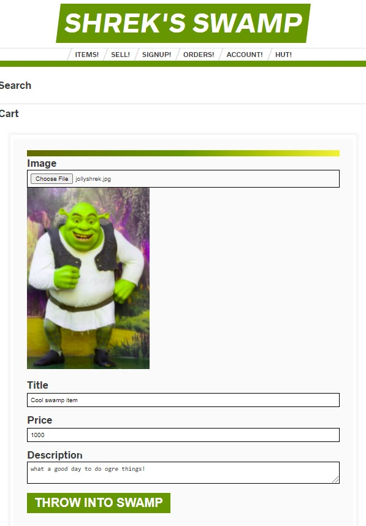
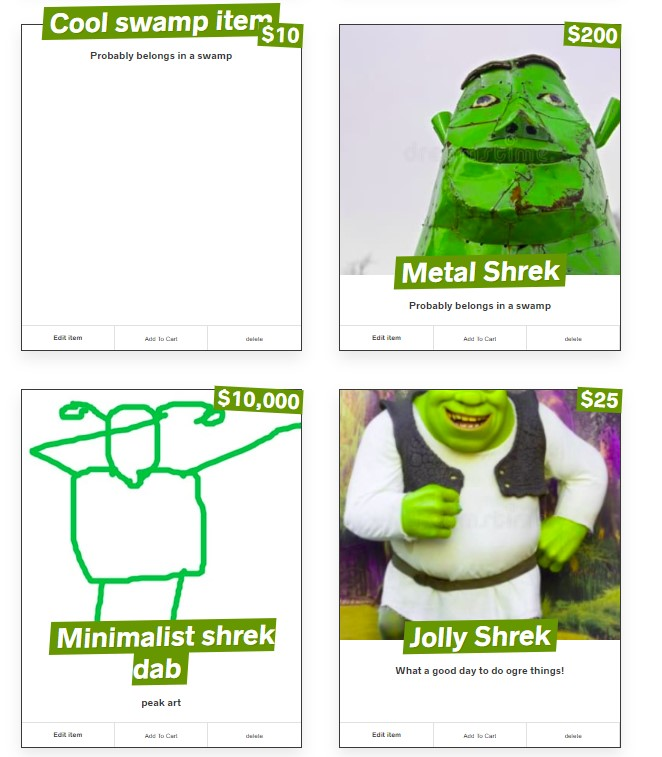

# Shrek's Swamp React Application
Based on the WesBos Sick Fits fullstack webapplication... but with a *Shrek twist!*

Not hosted anywhere yet (will be hosted on Heroku soon!)

Minimal functionality, and will remain so to an extent. This was mainly for pedagogical reasons to get a better understanding of smoe aspects of how the fullstack process works (working with React components, handling Mutations/Queries client and servier side).

#### Example pictures of the store!

The user can upload an image of their "item" that they wish to sell, (which is then hosted on [Cloudinary](https://cloudinary.com/))

Followed by entering a title, price, and description. Queries and Mutations are handled via **Apollo Client** and resolved and updated with **GraphQL Yoga** and **Prisma** on the back-end

#### The item is then published on the Items page!

The images in the right column are stock photos which I found distrubingly hilarious. Bottom left is one my own fine 30 second creation. Top left hasn't published yet because their is an asynchronous wait time for fetching images from Cloudinary after they've been submitted! (usually a few second wait)