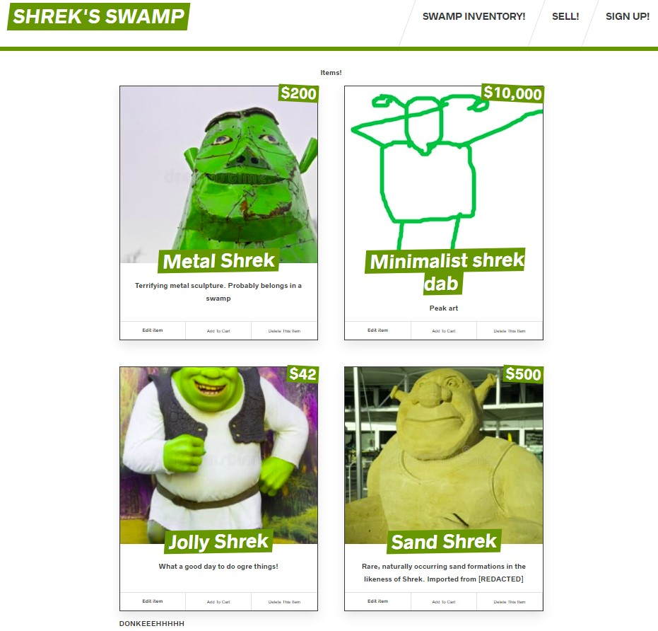

# Shrek's Swamp React Application
Based on the WesBos Sick Fits fullstack web application... but with a *Shrek twist!*

### Currently hosted with Heroku/Prisma at this [LINK](https://shreks-swamp-next-prod.herokuapp.com/) using whatever free tier services and features are available.

Minimal functionality, and will remain so to an extent. This was mainly for pedagogical reasons to get a better understanding of how some aspects of the fullstack process works (working with React components, handling Mutations/Queries client and server side, etc.).

#### Example pictures of the store!

The user can upload an image of their "item" that they wish to sell, (which is then hosted on [Cloudinary](https://cloudinary.com/)).

Followed by entering a title, price, and description. Queries and Mutations are handled via **Apollo Client** and resolved and updated with **GraphQL Yoga** and **Prisma** on the back-end

##### Side Note:
The store will reject you if there already are more than 6 items though, telling the user to delete some first.
(I chose a limit to respect the limitations of the free-tier services) 

#### The item is then published on the Items page (you may need to wait a bit and/or hit refresh on your browser)!

The image on the *top right* is one of my own fine 30 second creations.
The rest of the images are stock photos which I found distrubingly hilarious.

The user has the option to Delete or Edit the item. 
Attempting to add an item to cart will reject you with an intentional, silly message.
